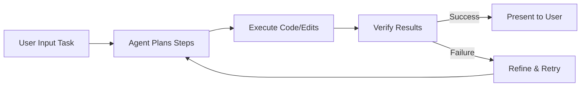

# 🧠 AI-Powered Agentic IDE Design Document

## 🌐 Overview

This design document outlines the architecture and implementation for building an AI-powered Integrated Development Environment (IDE) inspired by tools like **Google Anticentravity** and **Cursor**. The goal is to create an **"Agentic IDE"** that leverages AI agents to automate coding tasks, provide intelligent autocomplete, and enable natural language-based development. 🚀

Key features include:
- ✨ **AI Autocomplete and Code Generation**: Predictive suggestions and multi-line edits based on context.
- 🤖 **Agentic Workflows**: AI agents that plan, execute, verify, and iterate on tasks.
- 🔌 **Multi-Model Support**: Integration with various LLMs (e.g., Gemini, GPT models).
- 🖥️ **Cross-Surface Integration**: Synchronization across editor, terminal, and browser.
- 🕹️ **Mission Control Interface**: Central dashboard for managing multiple agents.

---

## 📋 Requirements

### ✅ Functional Requirements
- **🖥️ Editor Core**: Support syntax highlighting, debugging, and extensions.
- **🤖 AI Integration**: Natural language commands for code edits and autocomplete.
- **📚 Codebase Understanding**: Index and search the entire project for semantic context.
- **🎨 UI Enhancements**: Inline suggestions, chat panels, and a mission control view.
- **🔒 Security and Privacy**: Local indexing options and API key management.

### ⚡ Non-Functional Requirements
- **🚀 Performance**: Fast inference (under 500ms for autocomplete).
- **💻 Compatibility**: Cross-platform (Windows, macOS, Linux).
- **🔌 Extensibility**: Support for custom models and plugins.
- **🛡️ Reliability**: Error handling for AI failures with manual fallbacks.

---

## 🏛️ High-Level Architecture

The IDE is a modular system built on VS Code's foundation. Core components include the editor, AI engine, agent manager, and UI extensions.

### 🗺️ Architecture Diagram

---

## 🧩 Detailed Components

### 1. 🖥️ Editor Core
- **Base**: Fork `microsoft/vscode`.
- **Extensions**: Custom TypeScript extensions for AI features.
- **Implementation**: Electron for desktop app packaging.

### 2. 📚 Codebase Indexer
- **Purpose**: Builds a semantic index for context-aware AI.
- **Tech**: Tree-sitter for AST parsing, vector database (FAISS) for embeddings.

### 3. ⚙️ AI Engine
- **Core**: Handles autocomplete, code generation, and queries.
- **Integration**: API wrappers for Google Gemini, OpenAI, and Anthropic.

### 4. 🤖 Agent Manager
- **Task Planner**: Decomposes requests into steps.
- **Executor**: Runs code generation and terminal commands.
- **Verifier**: Validates outputs (syntax checks, tests).

### 🔄 Agent Workflow

### 5. 🎨 User Interface Extensions
- **🕹️ Mission Control**: Dashboard for agent status and artifacts.
- **⌨️ Shortcuts**: `Ctrl+K` for edits, `Ctrl+L` for chat, `F3` for Mission Control.

---

## 📅 Implementation Plan

- **Phase 1: 🏗️ Setup Base IDE (2-4 weeks)**
- **Phase 2: ✨ Core AI Features (4-6 weeks)**
- **Phase 3: 🤖 Agentic Capabilities (6-8 weeks)**
- **Phase 4: 🎨 UI & Cross-Surface (4 weeks)**
- **Phase 5: ✅ Testing and Polish (4 weeks)**

---

## 🛠️ Tech Stack

| Layer | Technology |
|-------|------------|
| **Frontend** | TypeScript, React |
| **Backend** | Node.js |
| **AI** | Gemini, GPT-4, Claude |
| **DB** | SQLite, FAISS |
| **Build** | Electron |

---

## ⚠️ Potential Challenges & Mitigations

- 🧠 **AI Hallucinations**: Use verification steps and user feedback loops.
- ⚡ **Performance**: Optimize context size; use fast models like Gemini Flash.
- 🔒 **Privacy**: Allow local-only modes and encrypted API traffic.

---

## ⌨️ Key Shortcuts

| Shortcut | Action |
|----------|--------|
| `Ctrl+K` | 📝 Inline code edit |
| `Ctrl+L` | 💬 Open AI chat panel |
| `Ctrl+I` | 📁 Multi-file edits |
| `F3`     | 🕹️ Open Mission Control |
