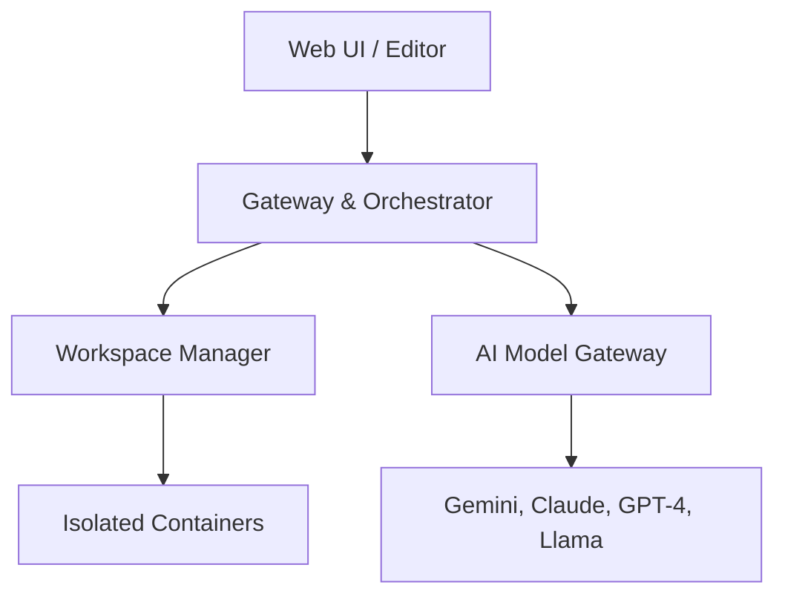

<div align="center">
  <br />
  
  <br />
  <h1>🌌 Open Anticentravity</h1>

  <p><b>The Open-Source, Universal AI Gateway for Agentic Development</b></p>
  <p>
    <i>An open, community-driven effort to build a truly model-agnostic alternative to proprietary agentic coding platforms.</i>
  </p>
  
  <p>
    <a href="#"></a>
    <a href="#"></a>
    <a href="#"></a>
    <a href="https://discord.gg/jc4xtF58Ve"></a>
    <a href="https://github.com/ishandutta2007">
      
    </a>
  </p>
</div>

---

**Open Anticentravity** 🌌 is not just another code editor or AI assistant. It's an ambitious open-source project to build a web-native, **agent-first** integrated development environment (IDE). Unlike proprietary platforms that lock you into a single AI ecosystem, Open Anticentravity is designed from the ground up to be a **universal gateway to any LLM**. Our goal is to create a platform where developers can delegate complex tasks to autonomous AI agents, powered by the models of their choice. 🤖✨

### 🌟 Why Open Anticentravity?
- **🔓 True Model Freedom:** Building a future that isn't tied to a single AI provider.
- **🗳️ Democratizing AI:** Making state-of-the-art agentic development accessible to everyone.
- **🛠️ Transparency & Extensibility:** An open core that the community can shape, extend, and trust.
- **🏠 Self-Hosting & Privacy:** Full control over your code, your data, and your AI connections.

---

## ✨ Core Features (The Vision)

- **🌌 Best of All Worlds:** Fusing the best features of Cursor, Windsurf, Trae, and Anticentravity into a single, cohesive experience.
- **🧠 Google's Cutting Edge:** Incorporating the powerful capabilities of **Google CodeMender** and **Google Jules** for state-of-the-art code generation.
- **🔒 Privacy First:** No code or environment info is sent to third parties without your consent. Your data stays yours!
- **🔌 Universal LLM Gateway:** Connect to GPT-4, Claude 3.5, Gemini 1.5 Pro, Llama 3, Deepseek, and more. A unified interface for all your agents.
- **🤖 Agent-First Workflow:** Delegate high-level tasks to autonomous agents that plan, write, and verify code.
- **🤝 Multi-Agent Collaboration:** Spawn multiple agents to work in parallel on different parts of your project.
- **🖼️ Verifiable Artifacts:** Agents generate tangible artifacts (Task Lists, Screenshots, Test Results) so you can trust their work.
- **🔄 Interactive Feedback:** Provide real-time feedback to agents as they work.

---

## 🏛️ High-Level Architecture

Open Anticentravity is a modular, container-native application designed for flexibility and scale. 🏗️



---

## 🚀 Roadmap

We have an ambitious journey ahead! 🗺️ Check out [**ROADMAP.md**](./ROADMAP.md) for the full details.

- **Phase 1:** 🏗️ Core Platform & Universal Gateway
- **Phase 2:** 🤖 Single-Agent Workflow & Tooling
- **Phase 3:** 🌌 Advanced Agentic Features (Multi-Agent)
- **Phase 4:** 🌈 Community & Extensibility

---

## 🛠️ Getting Started (Development)

Ready to build the future? 🛠️ Here’s how to get started locally.

**Prerequisites:**
- 🐳 Docker & Docker Compose
- 🟢 Node.js (v20+)
- 🐍 Python (v3.11+)

**Installation:**

1.  **Clone the repository:**
    ```bash
    git clone https://github.com/ishandutta2007/open-anticentravity.git
    cd open-anticentravity
    ```

2.  **Setup environment variables:**
    ```bash
    cp .env.example .env
    ```
    *Fill in your API keys in the `.env` file.* 🔑

3.  **Launch the environment:**
    ```bash
    docker-compose up --build
    ```
    Access the platform at `http://localhost:3000`. 🌐

---

## 🙌 How to Contribute

We welcome contributions from everyone! 💖 Whether you're a developer, designer, or writer, there's a place for you.

- 📖 Check out the [**Contribution Guide**](./CONTRIBUTING.md).
- 🐛 Look at the [**Open Issues**](https://github.com/ishandutta2007/open-anticentravity/issues).
- 💬 Join our [**Discord Server**](https://discord.gg/jc4xtF58Ve).

## 🙌 Contributors

<a href="https://github.com/ishandutta2007/open-anticentravity/graphs/contributors">
  
</a>

## ⭐ Star History

[](https://www.star-history.com/#ishandutta2007/open-anticentravity&type=date&legend=top-left)

---

## 📜 Disclaimer

**IMPORTANT: Please Read Carefully**

1. **Independent Project:** Open Anticentravity is an independent, community-driven open-source project. It is **NOT** an official product of Google LLC, Alphabet Inc., or any of its affiliates. This project is not endorsed, sponsored, or supported by Google.
2. **Trademarks:** "Antigravity", "Gemini", "Google", and all related logos and brand names are trademarks or registered trademarks of Google LLC. The use of these names in this project is strictly for identification and descriptive purposes and does not imply any affiliation with or endorsement by the trademark owners.
3. **Experimental Software:** This tool is currently in an experimental/beta stage. It is provided "as is" without any warranties of any kind, express or implied. The authors and contributors are not responsible for any data loss, security vulnerabilities, or other issues arising from the use of this software.
4. **Research & Development:** Open Anticentravity is intended for research and development purposes only. It should not be used in production environments without thorough independent verification.
5. **Third-Party Services:** Users are responsible for their own use of third-party AI models and APIs (including but not limited to Google Gemini, OpenAI, and Anthropic). You must comply with the respective Terms of Service and Privacy Policies of those providers.

## ⚖️ License

This project is licensed under the **MIT License**. See the [**LICENSE**](./LICENSE) file for details. 📄
