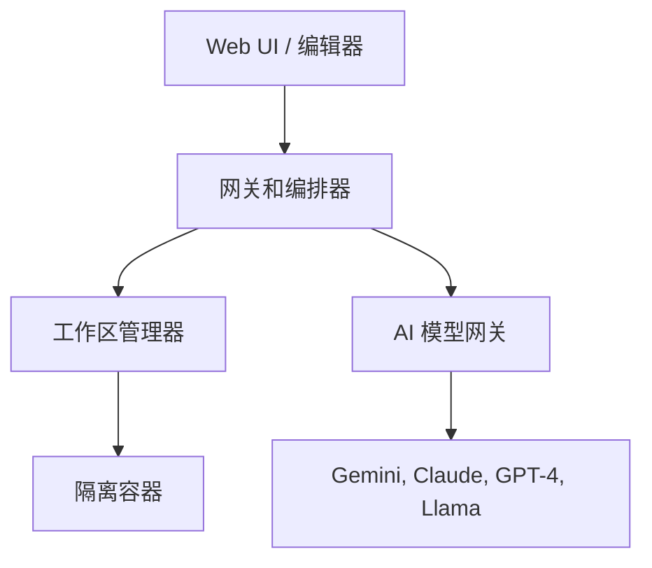

<div align="center">
  <br />
  
  <br />
  <h1>🌌 Open Anticentravity (中文版)</h1>

  <p><b>用于代理开发的开源通用 AI 网关</b></p>
  <p>
    <i>一个开放的、社区驱动的努力，旨在为专有的代理编码平台构建一个真正的模型无关的替代方案。</i>
  </p>
  
  <p>
    <a href="#"></a>
    <a href="#"></a>
    <a href="#"></a>
    <a href="https://discord.gg/jc4xtF58Ve"></a>
  </p>
</div>

---

**Open Anticentravity** 🌌 不仅仅是另一个代码编辑器或 AI 助手。它是一个雄心勃勃的开源项目，旨在构建一个 Web 原生的、**代理优先**的集成开发环境 (IDE)。与将您锁定在单个 AI 生态系统中的专有平台不同，Open Anticentravity 从头开始设计，旨在成为**任何 LLM 的通用网关**。我们的目标是创建一个平台，让开发人员可以将复杂的任务委托给自主的 AI 代理，并由他们选择的模型提供支持。 🤖✨

### 🌟 为什么选择 Open Anticentravity？
- **🔓 真正的模型自由：** 构建一个不依赖于单个 AI 提供商的未来。
- **🗳️ AI 民主化：** 让最先进的代理开发对每个人都可用。
- **🛠️ 透明度和可扩展性：** 创建一个社区可以塑造、扩展和信任的开放核心。
- **🏠 自托管和隐私：** 让您完全控制您的代码、数据和 AI 连接。

---

## ✨ 核心功能 (愿景)

- **🌌 集各家之长：** 旨在将 Cursor, Windsurf, Trae, 和 Anticentravity 的最佳功能融合到一个单一、内聚的体验中。
- **🧠 谷歌尖端技术：** 融合了 **Google CodeMender** 强大的代码修复能力和 **Google Jules** 的先进推理能力。
- **🔒 隐私第一：** 未经您的许可，不会将代码或环境信息发送给第三方。您的数据属于您！
- **🔌 通用 LLM 网关：** 连接到 GPT-4, Claude 3.5, Gemini 1.5 Pro, Llama 3, Deepseek 等。为您的所有代理提供统一的界面。
- **🤖 代理优先的工作流程：** 将高级任务委托给能够计划、编写和验证代码的自主代理。
- **🤝 多代理协作：** 生成可以并行工作在项目不同部分的多个代理。
- **🖼️ 可验证的工件：** 代理生成有形的工件（任务列表、屏幕截图、测试结果），以便您可以信任它们的工作。
- **🔄 交互式反馈：** 在代理工作时向其提供实时反馈。

---

## 🏛️ 高级架构

Open Anticentravity 被设计为一个模块化的、容器原生的应用程序，具有极高的灵活性。 🏗️



---

## 🚀 路线图

我们有一个雄心勃勃的旅程！🗺️ 有关详细分解，请参阅 [**ROADMAP.md**](./ROADMAP.md)。

- **第一阶段：** 🏗️ 核心平台和通用网关
- **第二阶段：** 🤖 单代理工作流程和工具
- **第三阶段：** 🌌 高级代理功能 (多代理)
- **第四阶段：** 🌈 社区和可扩展性

---

## 🛠️ 入门 (开发)

准备好构建未来了吗？🛠️ 以下是如何在本地运行项目的方法。

**先决条件：**
- 🐳 Docker 和 Docker Compose
- 🟢 Node.js (v20+)
- 🐍 Python (v3.11+)

**安装：**

1.  **克隆存储库：**
    ```bash
    git clone https://github.com/ishandutta2007/open-anticentravity.git
    cd open-anticentravity
    ```

2.  **设置环境变量：**
    ```bash
    cp .env.example .env
    ```
    *在 `.env` 文件中填写您的 API 密钥。* 🔑

3.  **启动环境：**
    ```bash
    docker-compose up --build
    ```
    在 `http://localhost:3000` 访问它。 🌐

---

## 🙌 如何贡献

我们欢迎每个人的贡献！💖 无论您是开发人员、设计师还是作家，这里都有您的位置。

- 📖 查看 [**贡献指南**](./CONTRIBUTING.md)。
- 🐛 查看 [**未解决的问题**](https://github.com/ishandutta2007/open-anticentravity/issues)。
- 💬 加入我们的 [**Discord 服务器**](https://discord.gg/jc4xtF58Ve)。

## ⭐ Star 历史

[](https://www.star-history.com/#ishandutta2007/open-anticentravity&type=date&legend=top-left)

---

## 📜 免责声明

**重要提示：请仔细阅读**

1. **独立项目：** Open Anticentravity 是一个独立的、社区驱动的开源项目。它**不是** Google LLC、Alphabet Inc. 或其任何子公司的官方产品。本项目未获得 Google 的认可、赞助或支持。
2. **商标：** “Antigravity”、“Gemini”、“Google” 以及所有相关的徽标和品牌名称均为 Google LLC 的商标或注册商标。在本项目中使用这些名称仅用于识别和说明目的，并不意味着与商标所有者有任何隶属关系或得到其认可。
3. **实验性软件：** 本工具目前处于实验/测试阶段。它按“原样”提供，不提供任何形式的明示或暗示担保。作者和贡献者不对因使用本软件而导致的任何数据丢失、安全漏洞或其他问题负责。
4. **研究与开发：** Open Anticentravity 仅用于研究和开发目的。未经彻底的独立验证，不应在生产环境中使用。
5. **第三方服务：** 用户对其使用的第三方 AI 模型和 API（包括但不限于 Google Gemini、OpenAI 和 Anthropic）负责。您必须遵守这些提供商各自的服务条款和隐私政策。

## ⚖️ 许可证

该项目根据 **MIT 许可证** 获得许可。有关详细信息，请参阅 [**LICENSE**](./LICENSE) 文件。 📄
