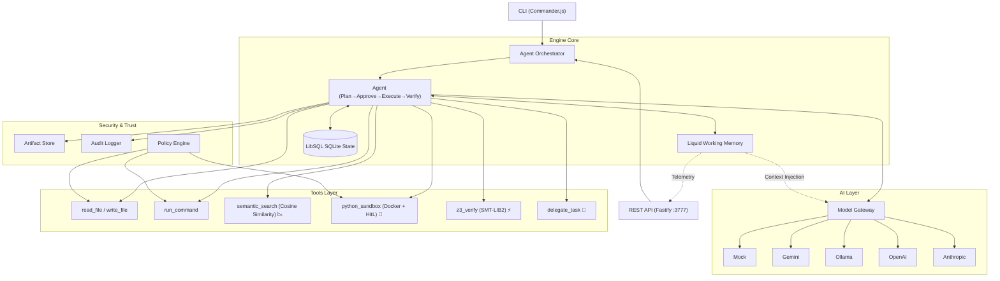

# OpenGravity Core Engine 🌌

> **A headless, infrastructure-first autonomous AI orchestration engine with Liquid Working Memory.**

OpenGravity is a production-grade backend engine designed to execute complex, multi-step software engineering tasks autonomously. It sits between user interfaces (like a CLI, VS Code extension, or web dashboard) and Large Language Models, providing a robust containerized sandbox, formal verification, and **a novel Liquid Working Memory system that prevents goal drift across multi-step execution.**

---

## 🧠 Breakthrough: Liquid Working Memory (LWM)

### The Problem: Context Degradation & Goal Drift in Agents
In multi-step agentic workflows, Large Language Models suffer from three critical bottlenecks:
1. **Goal Drift:** As an agent encounters errors, executes tools, and accumulates feedback, the original goal and invariants scroll out of the LLM's effective context window. The agent loses alignment and begins pursuing tangential fixes or infinite loops.
2. **Context Window Bloat:** Appending every historical tool output, debug attempt, and intermediate command directly into a linear chat history consumes thousands of tokens. This leads to massive API costs and degrades the model's reasoning capabilities.
3. **Observability Black Box:** During execution, there is no mathematical representation of what the agent swarm is focusing on, whether it is struggling with compile errors, or if it has drifted away from the original goal.

### The Solution: Continuous-Time Memory Graphs
OpenGravity implements **Liquid Working Memory (LWM)**—a lightweight, continuous-time memory graph that runs parallel to the LLM. It acts as shared "cognitive glue" to manage agent focus. LWM is inspired by Liquid Neural Networks (MIT CSAIL) but implemented as a lightweight, zero-dependency TypeScript structure—**no GPU required, no training needed, and zero runtime inference overhead.**

```
┌────────────────────────────────────────────────────────────┐
│                  LIQUID WORKING MEMORY                     │
│                                                            │
│   [ROOT GOAL: "Build Express API with auth"]               │
│    ├── activation: 0.92  (anchored, resists decay)         │
│    ├──→ [STEP 1: Create project]  activation: 0.15         │
│    ├──→ [STEP 2: Implement auth]  activation: 0.85         │
│    └──→ [ERROR: "bcrypt not found"] activation: 0.78       │
│                                                            │
│   Edges carry Hebbian-weighted connections:                 │
│    STEP 2 ──(0.8)──→ ERROR  (strong causal link)           │
│    STEP 1 ──(0.1)──→ STEP 2 (sequential dependency)       │
└────────────────────────────────────────────────────────────┘
```

#### 1. Discretized Differential Equations for Node Activation
LWM represents tasks, tools, observations, and feedback as nodes in a graph. Each node has an activation level $a_i \in [0, 1]$ representing its salience. With every system tick, node activations update according to a discretized differential approximation:

$$\frac{da_i}{dt} = -\gamma_i a_i + (1 - a_i) \left( \sum_{j} (w_{ji} a_j) + g_i \right)$$

Where:
- $\gamma_i$ is the node-specific decay rate (goal nodes decay extremely slowly, while transient tool logs or feedback decay rapidly).
- $g_i$ is the constant goal bias (acting as a gravity pull that anchors critical goals).
- $w_{ji}$ is the directed edge weight from node $j$ to node $i$.
- $\sum_{j} (w_{ji} a_j)$ represents the propagating activation from connected active nodes.

#### 2. Synaptic Plasticity via Hebbian Learning
To capture causal relationships between steps and errors, edges between nodes dynamically adapt using Hebbian learning rules (nodes that fire together, wire together):

$$\frac{dw_{ji}}{dt} = \eta \cdot a_j \cdot a_i - \lambda_w \cdot w_{ji}$$

Where:
- $\eta$ is the learning rate.
- $\lambda_w$ is the connection weight decay.

If a specific execution step repeatedly triggers a compile error, the edge between them strengthens, raising the salience of the error and feeding it directly into the LLM system prompt. When a step is successfully completed, its stimulus is dampened, causing it to decay naturally from active focus.

#### 3. Human-in-the-Loop Goal Approval Gate
Before execution starts, LWM enforces a safety gate:
1. The orchestrator generates a structured execution plan.
2. LWM initializes a goal node for the root task and each plan step.
3. A **Goal Confirmation Artifact** is generated showing the LWM's initial state.
4. The agent transitions to the `waiting_goal_approval` state, pausing execution.
5. Once a user approves via the REST API or CLI, the agent resumes execution.

---

## ✨ Core Features (V2 Architecture)

### 1. 📉 True Vector RAG (Semantic Token Reduction)
Instead of dumping entire source files into the LLM, OpenGravity performs Tool-Level RAG. When an agent requests context, the `semantic_search` tool chunks the codebase, generates vector embeddings locally using **Gemini (`text-embedding-004`)**, performs **Cosine Similarity** calculations, and returns only the most relevant snippets.
*Result: Context payload is reduced from 50,000+ tokens to under 500.*

### 2. 🐍 Containerized Python Sandbox (Pass-by-Reference Memory)
Passing large datasets through an LLM chat window degrades performance. OpenGravity enforces a **Pass-by-Reference** workflow. Agents write and execute Python scripts within a secure **Docker container**. Data files (CSVs, databases) are saved to a shared workspace volume. One agent pulls or generates data, and the next reads it directly from disk. The LLM acts purely as a coordinator, never touching raw data.

### 3. ⚡ Real Z3 SMT Formal Verification
LLMs write code by probabilistic guessing. OpenGravity mathematically proves correctness. Using the official **Microsoft `z3-solver` WASM library**, agents verify:
- Array bounds safety (out-of-bounds checks).
- Null/undefined dereference safety.
- Integer overflow and underflow invariants.
If verification fails, Z3 generates a concrete mathematical counterexample, forcing the agent to fix the bug before proceeding.

### 4. 🤖 Multi-Agent Protocol & Persistent State
- **Delegate Task Tool:** Agents can spawn specialized sub-agents with narrow scopes to solve complex sub-tasks in parallel.
- **LibSQL / SQLite Database Persistence:** All agents, plans, execution steps, and messages are persisted in a local database (`data/opengravity.db`). Agents can survive server restarts and resume execution without losing progress.

---

## 🏗️ Architecture



---

## 🚀 Quick Start

### Installation

```bash
# Clone the repository
git clone https://github.com/mkrishna793/open-antigravity.git
cd open-antigravity

# Install dependencies inside the newcore engine
cd newcore
npm install

# Setup environment variables
cp .env.example .env
```

### Usage (CLI)

```bash
# Check engine status and available tools
npm run cli info
npm run cli tools

# Run an agent (will pause at waiting_goal_approval)
npm run cli run "Create a plan for developing a new feature"

# Start interactive chat
npm run cli chat
```

### Running Server
```bash
npm run server
```
Exposes the API on port `3777`.

---

## 📡 LWM API Reference

### 1. Telemetry
Returns real-time cognitive telemetry of an agent's memory graph.
- **Protocol:** `GET`
- **Route:** `/agents/:id/memory/telemetry`
- **Response:**
```json
{
  "telemetry": {
    "activeFocus": "goal:step2",
    "activeGoals": ["root:task", "goal:step2"],
    "cognitiveLoad": 0,
    "swarmAttention": [
      { "nodeId": "goal:step2", "activation": 0.85 },
      { "nodeId": "root:task", "activation": 0.92 }
    ]
  },
  "nodes": [...],
  "edges": [...]
}
```

### 2. Goal Approval
Approves the agent's goals and resumes execution from the `waiting_goal_approval` state.
- **Protocol:** `POST`
- **Route:** `/agents/:id/memory/approve`

### 3. Manual Stimulus Injection
Manually injects an activation signal into a specific memory node.
- **Protocol:** `POST`
- **Route:** `/agents/:id/memory/stimulus`
- **Payload:**
```json
{
  "nodeId": "goal:step3",
  "intensity": 0.5,
  "content": "User redirected focus to step 3"
}
```

---

## 🧪 Testing

OpenGravity contains a robust test suite covering memory dynamics, differential equation decay, Hebbian plasticity, and agent lifecycle integration.

```bash
npm test
```

The test files validate:
- Node activation decay dynamics over ticks.
- Goal bias anchoring (goals resist decay).
- Edge propagation and Hebbian weight adjustments.
- Message history pruning and LWM prompt prefix synthesis.
- End-to-end agent planning, goal confirmation, and approval state-machine transitions.

---

## 📜 License
MIT License
